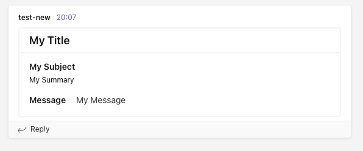

<h1 align="center">Send message to Microsoft Teams.</h1>

<p align="center">
  Send messages to teams from the command line or Go program.
  <br>
  Go module to send messages to MS Teams channel
  <br>
  using webhooks.
</p>

<p align="center">
  
</p>


**Command line:** Post messages to MS Teams channel from command line.

**Proxy support:** Works behind a proxy

**Flexible:** Flexible and simple interface to use in Go Programs.


## Installation

```sh
go install github.com/kevincobain2000/go-msteams@latest
```

### From Command Line:

```sh
go-msteams -hook=<required ms-teams webhook> -title= -subtitle= -subject= -message="<h1>HTML OK</h1>
```

### From Go program:

```go
import (
    gmt "github.com/kevincobain2000/go-msteams/src"
)

func main() {
    title := "" //optional
    subtitle := "" //optional
    subject := "Required" //optional
    color := "" //optional
    message := "" //optional
    hook := "https://required" //required
    proxy := "" //optional

    err := gmt.Send(title, subtitle, subject, color, message, hook, proxy)
	if err != nil {
		log.Println(err)
	} else {
		log.Println("Successfully sent!")
	}
}
```

--

### Command Line Params Help:

```sh
go-msteams -h
  -color string
    	Description: Your theme color
  -hook string
    	(required) Description: MS Teams webhook URL
  -message string
    	Description: Message body. HTML allowed. (default "My Message")
  -proxy string
    	Description: Hit behind this proxy
  -subject string
    	Description: Your subject (default "My Subject")
  -subtitle string
    	Description: Your summary (default "My Summary")
  -title string
    	Description: Your title (default "My Title")
```